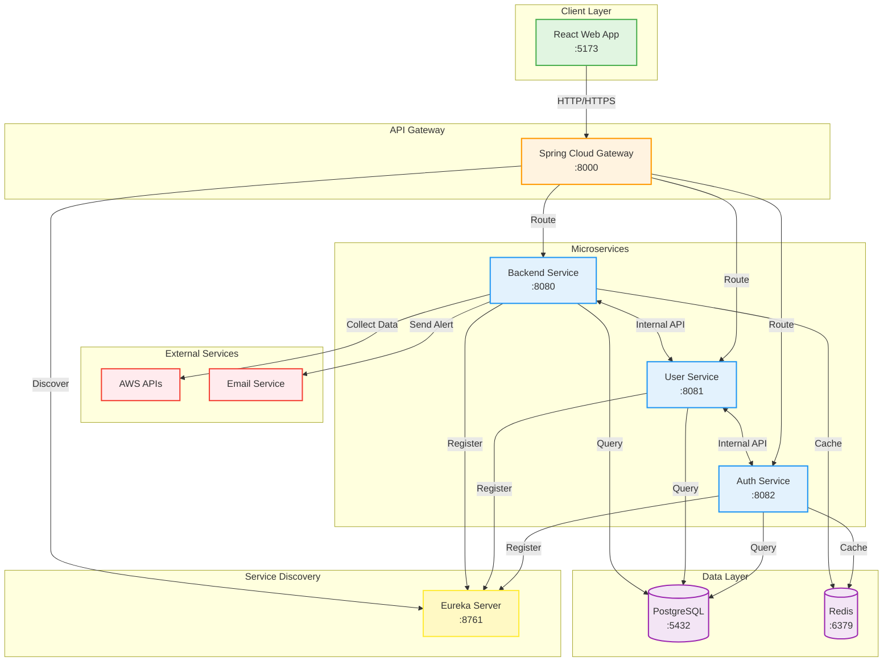
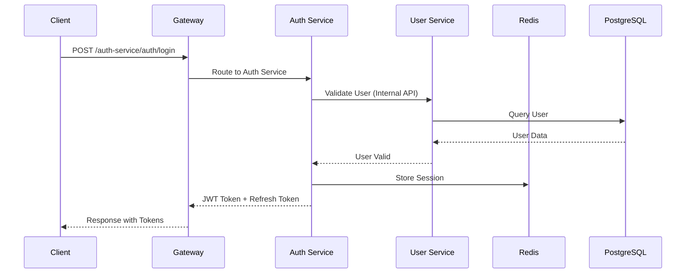
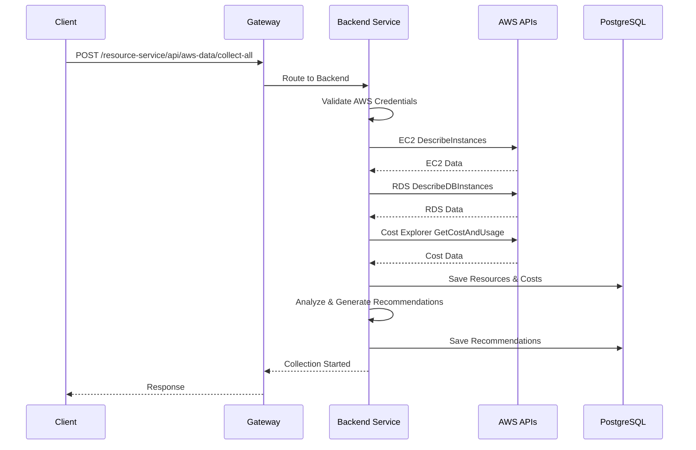

# 클라우드 비용 최적화 도구 시스템 아키텍처

## 시스템 구성도

## 서비스별 상세 설명

### 1. Client Layer
- **React Web Application**
  - 포트: 5173 (개발), 80/443 (운영)
  - 사용자 인터페이스 제공
  - API Gateway를 통해 백엔드 서비스와 통신

### 2. API Gateway (Spring Cloud Gateway)
- **포트**: 8000
- **역할**:
  - 모든 클라이언트 요청의 단일 진입점
  - 라우팅 및 로드 밸런싱
  - JWT 토큰 검증
  - CORS 처리
  - Rate Limiting

### 3. Service Discovery (Eureka Server)
- **포트**: 8761
- **역할**:
  - 마이크로서비스 등록 및 관리
  - 서비스 상태 모니터링
  - 동적 서비스 디스커버리

### 4. Microservices

#### 4.1 Auth Service
- **포트**: 8082
- **책임**:
  - 사용자 인증 (로그인/로그아웃)
  - JWT 토큰 발급 및 갱신
  - Refresh Token 관리

#### 4.2 User Service
- **포트**: 8081
- **책임**:
  - 사용자 계정 관리 (CRUD)
  - 프로필 정보 관리
  - 비밀번호 변경

#### 4.3 Backend Service (Core)
- **포트**: 8080
- **책임**:
  - AWS 계정 관리
  - 리소스 수집 및 분석
  - 비용 데이터 처리
  - 추천 생성 및 관리
  - 알림 처리
  - 설정 관리

### 5. Data Layer

#### 5.1 PostgreSQL
- **포트**: 5432
- **용도**:
  - 모든 영구 데이터 저장
  - 트랜잭션 처리
  - 복잡한 쿼리 지원

#### 5.2 Redis
- **포트**: 6379
- **용도**:
  - 세션 데이터 캐싱
  - JWT 블랙리스트
  - 임시 데이터 저장
  - 성능 최적화

## 데이터 흐름

### 1. 인증 플로우

### 2. 리소스 수집 플로우

## 보안 고려사항

### 1. 인증 및 권한
- JWT 기반 stateless 인증
- Refresh Token으로 토큰 갱신
- 서비스 간 통신은 내부 네트워크만 허용

### 2. 데이터 보안
- AWS 크레덴셜 암호화 저장 (AES-256)
- HTTPS 통신 (운영 환경)
- SQL Injection 방지

### 3. 네트워크 보안
- 방화벽 규칙 적용
- VPC 내부 통신
- API Rate Limiting

## 확장성 고려사항

### 1. 수평 확장
- 각 마이크로서비스는 독립적으로 확장 가능
- Eureka를 통한 동적 서비스 디스커버리
- 로드 밸런싱 지원

### 2. 데이터베이스 확장
- Read Replica 구성 가능
- 파티셔닝 전략 (날짜별 비용 데이터)
- 캐싱 전략 (Redis)

### 3. 비동기 처리
- AWS 데이터 수집은 비동기 처리
- 메시지 큐 도입 가능 (향후)

## 모니터링 및 로깅

### 1. 애플리케이션 모니터링
- Spring Boot Actuator
- 헬스 체크 엔드포인트
- 메트릭 수집

### 2. 로깅
- 중앙 집중식 로깅
- 로그 레벨 관리
- 감사 로그

### 3. 알림
- 시스템 장애 알림
- 리소스 사용량 알림
- 비용 임계치 알림

## 배포 환경

### 1. 개발 환경
- Docker Compose로 전체 스택 실행
- 로컬 PostgreSQL, Redis
- 개발용 AWS 계정

### 2. 운영 환경
- AWS EC2 인스턴스
- AWS RDS (PostgreSQL)
- AWS ElastiCache (Redis)
- CloudFront + S3 (Frontend)
- Application Load Balancer

## 기술 스택 요약

| 구분 | 기술 |
|------|------|
| Frontend | React, Vite, Axios |
| API Gateway | Spring Cloud Gateway |
| Microservices | Spring Boot 3.x, Java 17 |
| Service Discovery | Netflix Eureka |
| Database | PostgreSQL 13 |
| Cache | Redis 6.2 |
| Container | Docker, Docker Compose |
| CI/CD | GitHub Actions |
| Cloud | AWS (EC2, RDS, S3, CloudFront) |
| Monitoring | Spring Actuator, CloudWatch |
