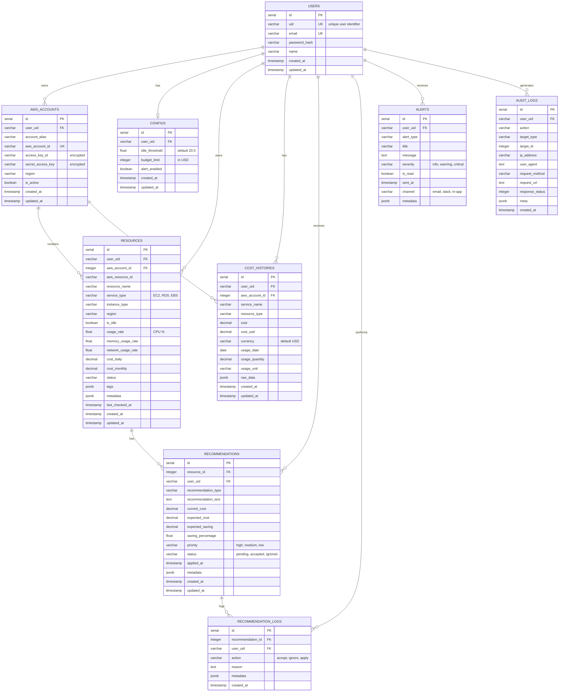

# 클라우드 비용 최적화 도구 ERD

## Entity Relationship Diagram

## 주요 관계 설명

### 1. 사용자 (USERS)
- 시스템의 핵심 엔티티로 모든 데이터의 소유자
- `uid`를 통해 마이크로서비스 간 사용자 식별
- 여러 AWS 계정을 등록하고 관리 가능

### 2. AWS 계정 (AWS_ACCOUNTS)
- 사용자가 등록한 AWS 계정 정보
- Access Key와 Secret Key는 암호화되어 저장
- 각 계정별로 리소스와 비용 데이터 수집

### 3. 리소스 (RESOURCES)
- AWS에서 수집된 실제 클라우드 리소스
- EC2, RDS, EBS 등 다양한 서비스 타입 지원
- 유휴 상태 및 사용률 정보 저장

### 4. 비용 이력 (COST_HISTORIES)
- AWS Cost Explorer API를 통해 수집된 비용 데이터
- 일별 비용 추적 및 분석
- 서비스별, 리소스별 비용 세분화

### 5. 추천 (RECOMMENDATIONS)
- 리소스 분석을 통한 비용 절감 추천
- 다운사이징, 중지, 삭제 등 다양한 추천 타입
- 예상 절감액 및 우선순위 정보 제공

### 6. 추천 로그 (RECOMMENDATION_LOGS)
- 사용자의 추천 수락/거절 이력
- 추천 효과성 분석을 위한 데이터

### 7. 알림 (ALERTS)
- 예산 초과, 유휴 리소스 감지 등 다양한 알림
- 이메일, Slack, 인앱 등 다중 채널 지원

### 8. 감사 로그 (AUDIT_LOGS)
- 시스템 내 모든 중요 활동 추적
- 보안 및 컴플라이언스를 위한 로깅

## 데이터베이스 특징

- **PostgreSQL** 사용
- **JSONB** 타입으로 유연한 메타데이터 저장
- 적절한 **인덱스**로 쿼리 성능 최적화
- **외래 키 제약**으로 데이터 무결성 보장
- **Cascade Delete**로 관련 데이터 자동 정리
